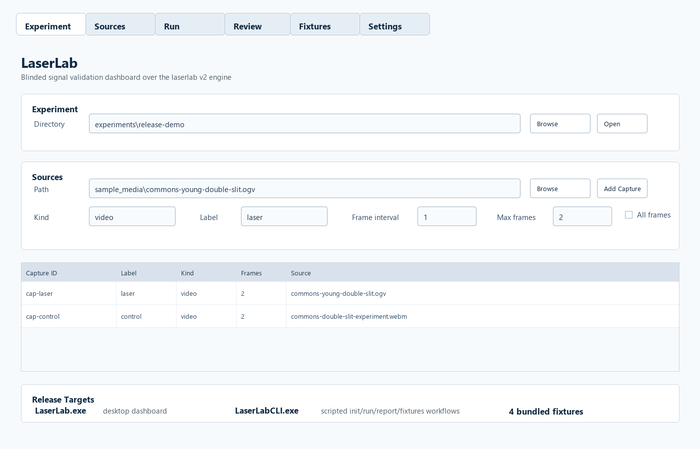
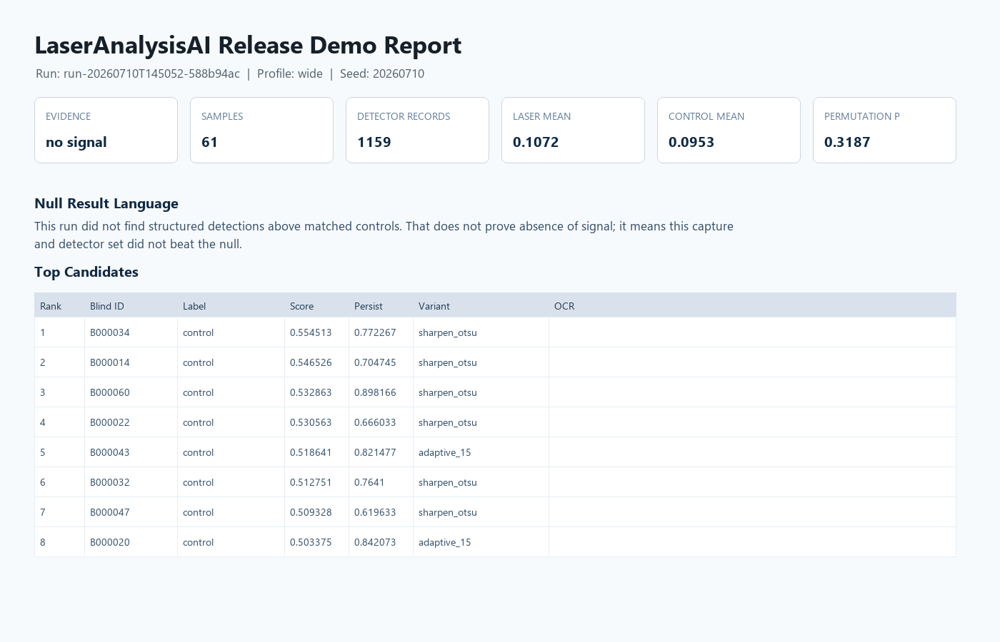

# LaserAnalysisAI

LaserAnalysisAI is now a LaserLab blinded validation lab for laser capture
analysis. It does not claim what a signal "means"; it tests whether existing
image or video captures contain repeatable structured detections above matched
controls.

The main user-facing app is a PyQt5 desktop dashboard. The `laserlab` package
also remains available as a CLI/API path for reproducible experiments, reports,
and statistical comparison.

## LaserLab Dashboard

The Windows release bundle contains:

- `LaserLab.exe`: desktop dashboard for experiment setup, runs, review, and export.
- `LaserLabCLI.exe`: command-line interface for scripted workflows.
- `sample_media\`: redistributable public optical/interference fixture clips.

Dashboard tabs:

- `Experiment`: create or open an experiment and ingest laser/control captures.
- `Run`: choose `baseline` or `wide`, set the blind seed, and run analysis.
- `Review`: inspect evidence stats, top candidates, processed images, and OCR text.
- `Fixtures`: review bundled public media and run a capped fixture demo.
- `Settings`: inspect local runtime and output paths.




## Quick Start

Use Python 3.10 or 3.11. On this workstation, the preferred interpreter is:

```powershell
$PY = "C:\Users\RhythmicCarnage\AppData\Local\Programs\Python\Python310\python.exe"
& $PY -m venv .venv310
.\.venv310\Scripts\python.exe -m pip install -r requirements.txt
```

Run the dashboard from source:

```powershell
.\.venv310\Scripts\python.exe main.py
```

Run tests:

```powershell
.\.venv310\Scripts\python.exe -m unittest discover -s tests
```

Run the bundled demo through the same API layer used by the dashboard:

```powershell
.\scripts\run_fixture_demo.ps1 -Python .\.venv310\Scripts\python.exe -Experiment experiments\release-demo -MaxFrames 2 -Profile wide
```

## CLI Workflow

Create or append captures to an experiment:

```powershell
.\.venv310\Scripts\python.exe -m laserlab.cli init --source C:\captures\laser --kind image-set --label laser --experiment experiments\trial-001
.\.venv310\Scripts\python.exe -m laserlab.cli init --source C:\captures\control --kind image-set --label control --experiment experiments\trial-001
```

For video sources, use `--all-frames` to turn the frame dial fully open:

```powershell
.\.venv310\Scripts\python.exe -m laserlab.cli init --source C:\captures\laser.mp4 --kind video --label laser --experiment experiments\trial-001 --all-frames
```

Run blinded analysis:

```powershell
.\.venv310\Scripts\python.exe -m laserlab.cli run --experiment experiments\trial-001 --profile baseline --blind-seed 123
```

Run a wider preprocessing sweep:

```powershell
.\.venv310\Scripts\python.exe -m laserlab.cli run --experiment experiments\trial-001 --profile wide --blind-seed 123
```

Regenerate the latest report:

```powershell
.\.venv310\Scripts\python.exe -m laserlab.cli report --experiment experiments\trial-001 --format both
```

List or fetch fixture media:

```powershell
.\.venv310\Scripts\python.exe -m laserlab.cli fixtures list --include-restricted
.\.venv310\Scripts\python.exe -m laserlab.cli fixtures fetch --output sample_media
```

## Outputs

- `manifest.json`: stable experiment record with sources, captures, frame
  sampling, preprocessing profiles, detectors, blinding seed, and output paths.
- `runs/<run-id>/results.json`: per-frame/per-variant detector records,
  OCR status, ROI crops, hashes, blinded IDs, unblinded labels, and aggregate
  statistics.
- `runs/<run-id>/report.html`: human-readable evidence summary with top
  candidates and null-result language.

## Evidence Ladder

Reports classify each run into one of these levels:

- `no signal`: laser scores did not exceed matched controls.
- `artifact`: detections are better explained by controls or weak differences.
- `anomaly`: elevated structure exists, but not enough for a controlled claim.
- `above-control candidate`: laser captures beat controls under permutation
  testing and effect-size thresholds.
- `repeatable candidate`: above-control evidence plus frame-to-frame persistence.

The system is intentionally conservative. A null result means this detector set
and capture set did not beat the control baseline, not that the broader idea is
disproven.

## Fixtures

The fixture catalog includes small Wikimedia Commons optical/interference videos
with explicit Creative Commons licensing, plus an external pointer to the
Illinois Wesleyan/American Journal of Physics single-photon video set. The IWU
set is scientifically stronger but stays external/manual until redistribution
terms are confirmed.

## Build Windows Release

```powershell
.\scripts\build_windows_exe.ps1 -Python .\.venv310\Scripts\python.exe -OutputDir dist
```

The release zip is written to:

```text
dist\LaserLab-windows.zip
```

## Legacy Viewer Status

The old single-column OCR viewer has been retired from the primary app path.
Legacy helper modules remain in the repo where they still support compatibility,
but new development should target the `laserlab` engine and the LaserLab
dashboard.
